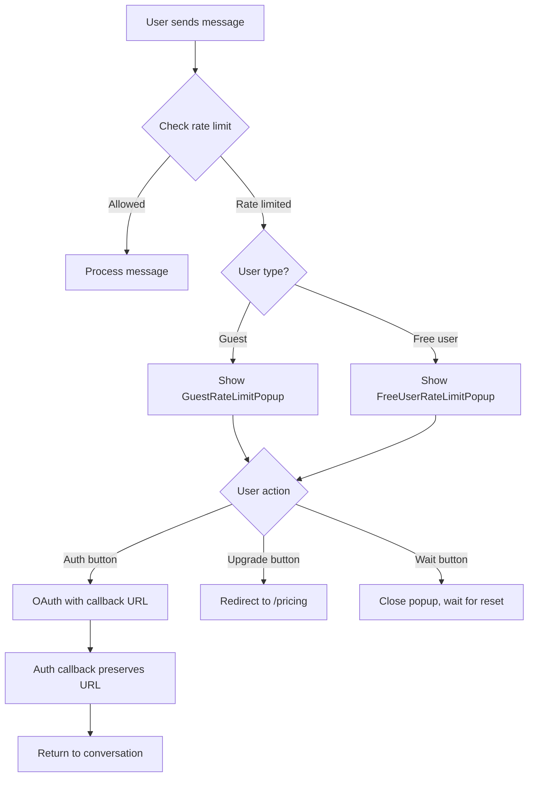

<!-- 3bee7974-cd8b-4119-b2e6-2b762527da3e ad4d5127-1e04-4093-9a2c-104c80d59ca2 -->
# Rate Limit Popup Integration Plan

## Overview

Integrate the rate limit popups (`GuestRateLimitPopup` and `FreeUserRateLimitPopup`) into the chat flow. Popups should appear:

1. **After the 10th message** (guest users) or **20th message** (free users) when the limit is reached
2. **When rate-limited users attempt to send messages** (immediate popup, no background processing)
3. Auth buttons should work like login/signup page (preserve callback URL)
4. Upgrade button redirects to `/pricing` (handle gracefully if page doesn't exist)

## Architecture

### Flow Diagram



## Implementation Phases

### Phase 1: Rate Limit State Management

**Create `lib/contexts/RateLimitContext.tsx`**

- Context to manage rate limit state globally
- Tracks: `isRateLimited`, `resetTime`, `userType` (guest/free), `layer` (redis/database)
- Provides: `setRateLimitState()`, `clearRateLimitState()`, `checkRateLimitStatus()`
- Auto-clears when reset time passes

**Key functions:**

```typescript
interface RateLimitState {
  isRateLimited: boolean;
  resetTime: number | null;
  userType: 'guest' | 'free' | null;
  layer: 'redis' | 'database' | null;
}

const RateLimitContext = createContext<{
  state: RateLimitState;
  setRateLimitState: (state: RateLimitState) => void;
  clearRateLimitState: () => void;
} | null>(null);
```

### Phase 2: Error Interception in Chat Client

**Modify `components/conversation/ConversationClient.tsx`**

1. **Import rate limit context and popups:**
   ```typescript
   import { useRateLimit } from '@/lib/contexts/RateLimitContext';
   import { GuestRateLimitPopup } from '@/components/test/GuestRateLimitPopup';
   import { FreeUserRateLimitPopup } from '@/components/test/FreeUserRateLimitPopup';
   ```

2. **Enhance `handleError` callback:**

   - Check if error is 429 (rate limit)
   - Extract rate limit info from error response or headers
   - Determine user type (guest vs free) from auth context
   - Set rate limit state in context
   - Don't show toast for rate limit errors (popup handles it)

3. **Intercept rate limit from response headers:**

   - `useChat` transport can access response headers
   - Check `X-RateLimit-Remaining` header after each message
   - If `remaining === 0`, set rate limit state proactively

4. **Prevent message sending when rate limited:**

   - Check rate limit state before calling `sendMessage`
   - Show popup immediately if rate limited
   - Return early (no API call)

**Key modifications:**

```typescript
const { state: rateLimitState, setRateLimitState } = useRateLimit();
const { user } = useAuth();

// Enhanced error handler
const handleError = React.useCallback((error: Error & { status?: number; response?: Response }) => {
  // Check if it's a rate limit error (429)
  if (error.status === 429 || error.message?.includes('rate limit')) {
    // Extract reset time from error or headers
    const resetTime = extractResetTime(error);
    const layer = extractLayer(error);
    
    setRateLimitState({
      isRateLimited: true,
      resetTime,
      userType: user ? 'free' : 'guest',
      layer: layer || 'database',
    });
    
    // Don't show toast - popup handles it
    return;
  }
  
  // Handle other errors normally
  const userMessage = handleClientError(error, 'conversation/chat');
  showToastError(userMessage);
}, [user, setRateLimitState, showToastError]);

// Prevent sending when rate limited
const handleSubmit = useCallback(async (e: React.FormEvent) => {
  e.preventDefault();
  
  if (rateLimitState.isRateLimited) {
    // Popup already showing, just return
    return;
  }
  
  // ... rest of submit logic
}, [rateLimitState, input, isLoading, sendMessage]);
```

### Phase 3: Response Header Monitoring

**Modify `DefaultChatTransport` in `ConversationClient.tsx`**

The transport needs to check response headers after each message to detect when limit is reached (before the next attempt).

**Approach:**

- Create custom transport wrapper that checks headers
- After successful message, check `X-RateLimit-Remaining` header
- If `remaining === 0`, proactively set rate limit state
- This shows popup immediately after the 10th/20th message

**Implementation:**

```typescript
const transport = useMemo(() => {
  const baseTransport = new DefaultChatTransport({
    api: '/api/chat',
    prepareSendMessagesRequest({ messages }) {
      return {
        body: {
          messages,
          conversationId: conversationIdRef.current,
          model: selectedModelRef.current,
          chatMode: chatModeRef.current,
        },
      };
    },
  });
  
  // Wrap to intercept headers
  return {
    ...baseTransport,
    async send(request: Request) {
      const response = await baseTransport.send(request);
      
      // Check rate limit headers
      const remaining = response.headers.get('X-RateLimit-Remaining');
      const reset = response.headers.get('X-RateLimit-Reset');
      const layer = response.headers.get('X-RateLimit-Layer');
      
      if (remaining === '0' && reset) {
        setRateLimitState({
          isRateLimited: true,
          resetTime: parseInt(reset, 10),
          userType: user ? 'free' : 'guest',
          layer: (layer as 'redis' | 'database') || 'database',
        });
      }
      
      return response;
    },
  };
}, [user, setRateLimitState]);
```

### Phase 4: Popup Rendering

**Add popups to `ConversationClient.tsx`**

1. **Render popups conditionally:**
   ```typescript
   return (
     <>
       {/* ... existing JSX ... */}
       
       {rateLimitState.isRateLimited && !user && (
         <GuestRateLimitPopup
           isOpen={true}
           onClose={() => {
             // Don't clear state - user is still rate limited
             // Just close popup, they can click "Wait" again
           }}
           reset={rateLimitState.resetTime || Date.now()}
           layer={rateLimitState.layer || 'database'}
         />
       )}
       
       {rateLimitState.isRateLimited && user && (
         <FreeUserRateLimitPopup
           isOpen={true}
           onClose={() => {
             // Don't clear state - user is still rate limited
           }}
           onUpgrade={() => {
             router.push('/pricing');
           }}
           reset={rateLimitState.resetTime || Date.now()}
         />
       )}
     </>
   );
   ```

2. **Auto-close when reset time passes:**

   - Popups already have auto-close logic in `useEffect`
   - When reset time passes, popup closes and clears rate limit state

### Phase 5: Auth Button Integration

**Modify `components/test/GuestRateLimitPopup.tsx`**

1. **Replace icon-only buttons with `AuthButton` components:**
   ```typescript
   import AuthButton from '@/components/auth/AuthButton';
   import { useSearchParams } from 'next/navigation';
   import { usePathname } from 'next/navigation';
   
   // In component:
   const searchParams = useSearchParams();
   const pathname = usePathname();
   
   // Preserve current URL as callback
   const callbackUrl = `${pathname}${searchParams.toString() ? `?${searchParams.toString()}` : ''}`;
   const callbackUrlParam = `?callbackUrl=${encodeURIComponent(callbackUrl)}`;
   
   // Replace icon buttons with:
   <div className="auth-buttons">
     <AuthButton provider="google" />
     <AuthButton provider="twitter" />
     <AuthButton provider="github" />
   </div>
   ```

2. **Note:** `AuthButton` already reads `callbackUrl` from search params, so we need to:

   - Either modify `AuthButton` to accept `callbackUrl` as prop
   - Or set `callbackUrl` in URL before rendering popup
   - Or create wrapper that sets search params

**Better approach:** Modify `AuthButton` to accept optional `callbackUrl` prop:

```typescript
// In AuthButton.tsx
interface AuthButtonProps {
  provider: 'github' | 'google' | 'twitter';
  onClick?: () => void;
  callbackUrl?: string; // NEW: Override callback URL
}

// In component:
const callbackUrl = props.callbackUrl || searchParams.get('callbackUrl') || '/';
```

### Phase 6: Upgrade Button Redirect

**Modify `components/test/FreeUserRateLimitPopup.tsx`**

1. **Add router navigation:**
   ```typescript
   import { useRouter } from 'next/navigation';
   
   // In component:
   const router = useRouter();
   
   const handleUpgrade = () => {
     router.push('/pricing');
   };
   
   // Pass to popup:
   <FreeUserRateLimitPopup
     onUpgrade={handleUpgrade}
     // ...
   />
   ```

2. **Handle missing `/pricing` page gracefully:**

   - If page doesn't exist, Next.js will show 404
   - We can add a placeholder page later
   - For now, redirect works (user sees 404, which is acceptable)

### Phase 7: Homepage Integration

**Modify `components/homepage/MainInput.tsx`**

1. **Add rate limit check before navigation:**

   - Check rate limit state before creating new conversation
   - If rate limited, show popup instead of navigating
   - Prevent conversation creation when rate limited

**Implementation:**

```typescript
import { useRateLimit } from '@/lib/contexts/RateLimitContext';
import { GuestRateLimitPopup } from '@/components/test/GuestRateLimitPopup';
import { FreeUserRateLimitPopup } from '@/components/test/FreeUserRateLimitPopup';

// In component:
const { state: rateLimitState } = useRateLimit();

const handleSend = () => {
  // Check rate limit first
  if (rateLimitState.isRateLimited) {
    // Popup will show (rendered below)
    return;
  }
  
  // ... rest of send logic
};

// Render popups at bottom of component
```

### Phase 8: Context Provider Setup

**Modify `app/layout.tsx` or root layout**

1. **Wrap app with `RateLimitProvider`:**
   ```typescript
   import { RateLimitProvider } from '@/lib/contexts/RateLimitContext';
   
   // In root layout:
   <RateLimitProvider>
     {children}
   </RateLimitProvider>
   ```


## File Changes Summary

### New Files

- `lib/contexts/RateLimitContext.tsx` - Rate limit state management

### Modified Files

- `components/conversation/ConversationClient.tsx` - Error handling, popup rendering, transport wrapper
- `components/homepage/MainInput.tsx` - Rate limit check, popup rendering
- `components/auth/AuthButton.tsx` - Add `callbackUrl` prop support
- `components/test/GuestRateLimitPopup.tsx` - Use `AuthButton` with callback URL
- `components/test/FreeUserRateLimitPopup.tsx` - Add router navigation
- `app/layout.tsx` - Add `RateLimitProvider` wrapper

## Edge Cases & Considerations

1. **Multiple tabs:** Rate limit state is per-tab (client-side). Each tab checks independently.
2. **Network errors:** Rate limit errors (429) are distinct from network errors. Handle separately.
3. **Auth state changes:** If guest signs in while rate limited, popup should switch from guest to free (if free user also rate limited).
4. **Reset time accuracy:** Use reset time from API response headers (most accurate).
5. **Popup persistence:** Popup stays open until user clicks action or reset time passes.
6. **Message count tracking:** We don't track message count client-side. Rely on API headers.

## Testing Checklist

- [ ] Guest user: Popup shows after 10th message
- [ ] Free user: Popup shows after 20th message
- [ ] Rate-limited user: Popup shows immediately on message attempt
- [ ] Auth buttons: Redirect to OAuth, then back to conversation
- [ ] Upgrade button: Redirects to `/pricing`
- [ ] Wait button: Closes popup, user can wait
- [ ] Auto-close: Popup closes when reset time passes
- [ ] Homepage: Rate limit check prevents new conversation creation
- [ ] Multiple tabs: Each tab handles rate limit independently
- [ ] Network errors: Don't trigger rate limit popup

## Implementation Order

1. Create `RateLimitContext` (Phase 1)
2. Add context provider to layout (Phase 8)
3. Modify `ConversationClient` error handling (Phase 2)
4. Add transport header monitoring (Phase 3)
5. Add popup rendering (Phase 4)
6. Modify `AuthButton` for callback URL (Phase 5)
7. Update guest popup to use `AuthButton` (Phase 5)
8. Add upgrade button navigation (Phase 6)
9. Add homepage integration (Phase 7)
10. Test all scenarios